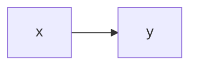

# Example: static page

An example static page!

## Using math

You can use inline math like $y = x^2$. Or `$$` blocks:

$$
\lim_{x \to \infty} (1 + 1/x)^n
$$

If you want `\\(` blocks, you'll need some extra configuration. See the [zensical docs](https://zensical.org/docs/authoring/math/) for more details.

## Using mermaid diagrams

And also mermaid diagrams:

See the [zensical docs](https://zensical.org/docs/authoring/diagrams/) for more details.
